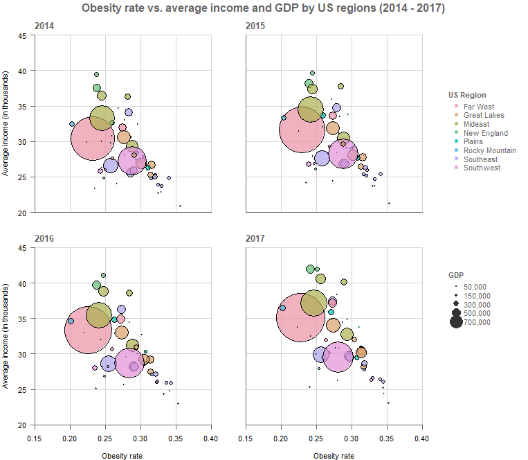
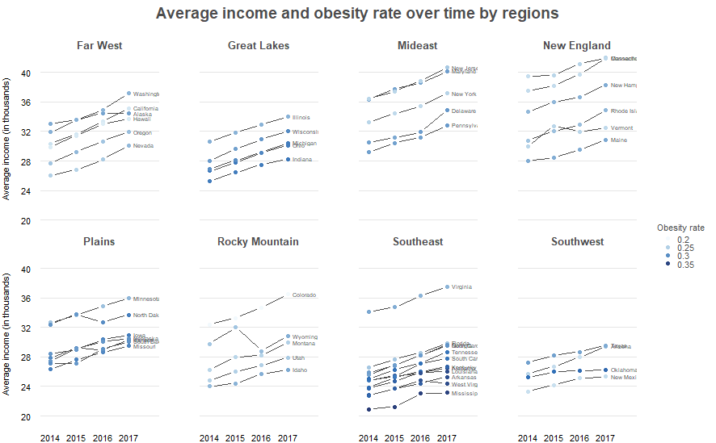

# Obesity Rate by US Regions

In this visualization I want to analyze the obesity rate by income in the different regions of The United States.

## The Data

The data used in this analysis was taken from [Kaggle](https://www.kaggle.com/datasets/annedunn/obesity-and-gdp-rates-from-50-states-in-20142017) title as *Obesity and GDP Rates from 50 States in 2014-2017*. It consists of measurements collected from 50 US states during the years 2014, 2015, 2016, and 2017. Among the measurements we can encounter obesity and poverty rates, average income and age, population, and GDP.

|Variable|Description|
|---|----|
|State||
|Year||
|AdultObesity||
|AverageAge||
|AverageIncome||
|Population||
|PovertyRate||
|GDP||
|PersonalIncome||
|Region||
|GDPPerCapita||

## Visualizations

## Observations

Based on the bubble charts, we can observed, mostly, that the lower the GDP of the state the higher the obesity rate. Moreover, one particular state in the Far West region, which has the highest GPD seems to have one of the lowest obesity rate but a medium average income. Regions such has Mideast and New England seems to have a median GPD, median obesity rate but a high average income. In this plot, average income, obesity rate, and GDP seem not to change too much over time.

In the slope charts, we can easily see that the Far West, Mideast, New England, and Rocky Mountain regions has the lowest obesity rate in almost all their states. On the other hand, Southeast and Great Lakes seem to have the highest obesity rate. It is also important to notice that Southeast is one of the regions with the lowest average income in almost all its states and that New England is one of the regions with highest
average income. Lastly, we can also observe that obesity rate seems not to change too much from 2014 to 2017.
