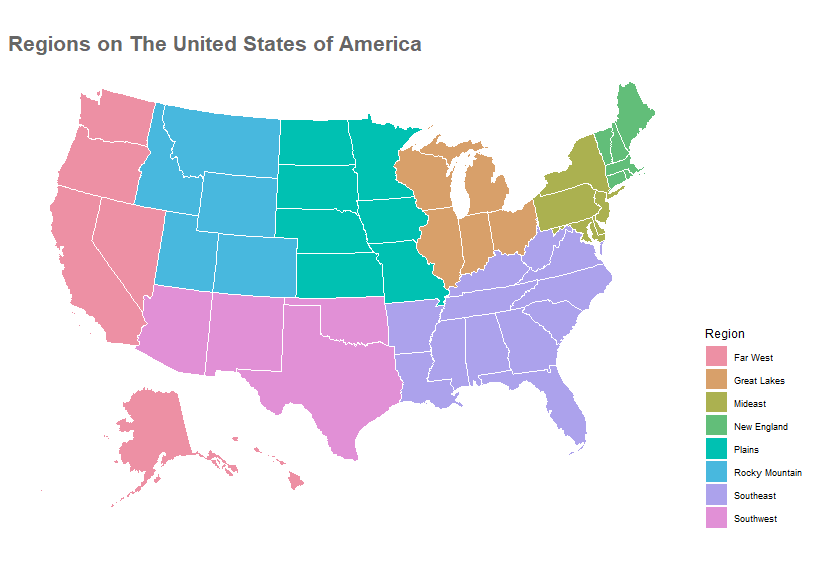
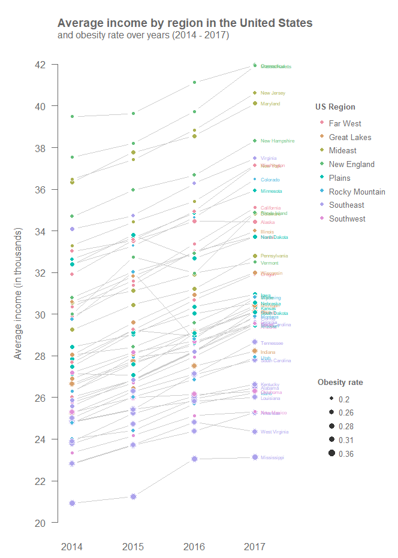

# Obesity Rate by US Regions

In this visualization I want to analyze the obesity rate by income in the different regions of The United States.

## The Data

The data used in this analysis was taken from [Kaggle](https://www.kaggle.com/datasets/annedunn/obesity-and-gdp-rates-from-50-states-in-20142017) title as *Obesity and GDP Rates from 50 States in 2014-2017*. It consists of measurements collected from 50 US states during the years 2014, 2015, 2016, and 2017. Among the measurements, we can encounter obesity and poverty rates, average income and age, population, and GDP. A full description of the variables in the dataset is presented in the tavble below.

|Variable            |Description                                   |
|--------------------|----------------------------------------------|
|`State`             |US states (50 unique values)                  |
|`Year`              |Year: 2014-2017                               |
|`AdultObesity`      |Adult obesity rate                            |
|`AdultObesity100`   |Adult obesity percentage                      |
|`AverageAge`        |Average age                                   |
|`AverageIncome`     |Average income                                |
|`Population`        |Population                                    |
|`PovertyRate`       |Poverty rate                                  |
|`PovertyRate100`    |Poverty percentage                            |
|`RealGDP`           |Real gross domestic product                   |
|`RealGDPGrowth`     |Real GDP Growth                               |
|`RealGDPGrowth100`  |Real GDP Growth in percent                    |
|`RealPersonalIncome`|Real personal income                          |
|`Region`            |US regions (8 unique values)                  |
|`RegionEncoding`    |US region by code: 1-8                        |
|`Unit`              |Unique value: Millions of chained 2012 dollars|
|`RealGDPPerCapita`  |Real GDP per capita                           |
|`YearFE`            |Year fixed effect (same as `Year`)            |

## Visualizations

For future references I have plotted the US states encoded by color according to the eight different regions presented in the dataset: *Far West*, *Great Lakes*, *Mideast*, *New England*, *Plains*, *Rocky Montain*, *Southeast*, and *Southwest*.

The following bubble chart panel presents the evolution of three measures in four different year, three continous variables: obesity rate, average income, and real GDP; and one categorical variable for grouping: US region. GDP is encoding as the size of the bubble. Due to the huge difference between the lowest and highest GDP, only a few of sized are displayed in the legend for reference.

In the slope chart panel, we can observe the evolution of obesity rate and average income over the four years by the eight US regions. In each of the regions, the slop line is labeled with the correspinding state. The color of the dots represent the obesity rate being 0.2 the lightest and 0.35 the darkest blue.

The last slope chart colapse all slope lines from the previous chart into one. Obesity rate is now eoncoded as the size of the dot. Beside the end of each line, the name of the state is presented, the color encoding represent the US region that each state belong.

## Observations

Based on the bubble charts, we can observed, mostly, that the lower the GDP of the state the higher the obesity rate. Moreover, one particular state in the Far West region, which has the highest GPD seems to have one of the lowest obesity rate but a medium average income. Regions such has Mideast and New England seems to have a median GPD, median obesity rate but a high average income. In this plot, average income, obesity rate, and GDP seem not to change too much over time.

In the slope charts, we can easily see that the Far West, Mideast, New England, and Rocky Mountain regions has the lowest obesity rate in almost all their states. On the other hand, Southeast and Great Lakes seem to have the highest obesity rate. It is also important to notice that Southeast is one of the regions with the lowest average income in almost all its states and that New England is one of the regions with highest average income. Lastly, we can also observe that obesity rate seems not to change too much from 2014 to 2017.
