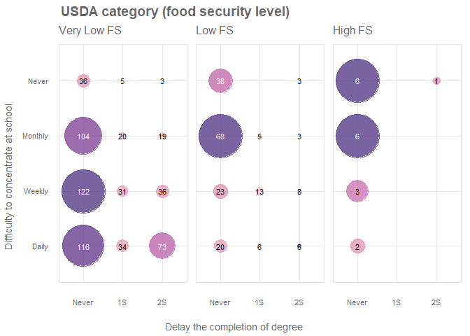
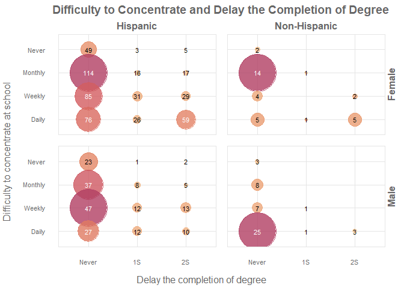
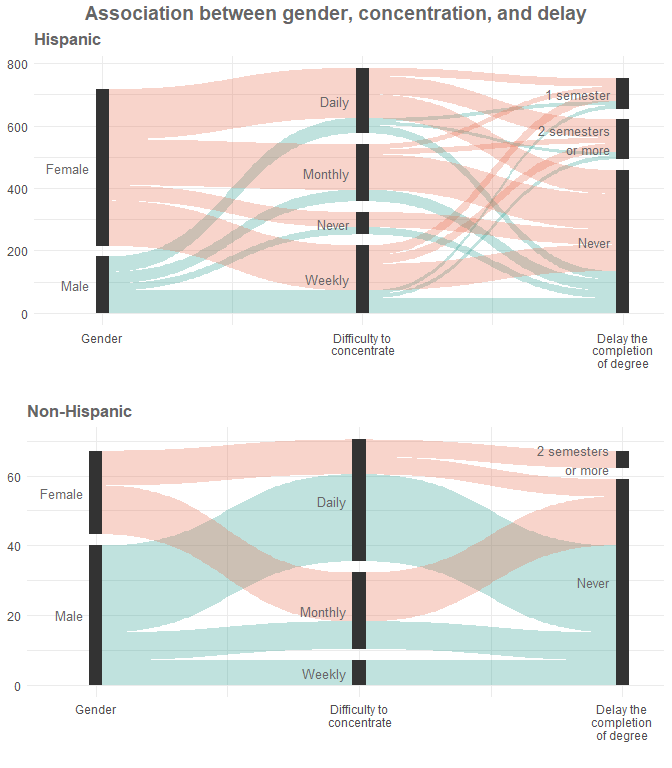

# Food Security in UTEP Students and its Relation with Federal Aid, Degree Completion, and Difficulty to Concentrate

## Table of Content

- [The Data](#data)
- [Exploring the data](#exploring)
  - [Knowing the Students](#knowing)
  - [Job and Academic Information](#job)
  - [Personal Situation](#personal)
- [Exploring Relationships](#exploring2)
  - [Federal Aid and Food Security](#fedaid)
  - [Food Security, Concentration on School, and Degree Completion](#food)
  - [Concentration on School and Degree Completion by Gender and Ethnicity](#concentration)

## The Data 

The University of Texas at El Paso (UTEP) has been collecting data on food and housing security of UTEP students since 2019 and continuous to this day. The following table presents some of the questions used in the survey applied to UTEP students.

|Variable             |Meaning                                                             |Notes                                                                         |
|:--------------------|:-------------------------------------------------------------------|:-----------------------------------------------------------------------------|
|Enroll               |Enrollment type at UTEP                                             |1-‘Full-time’;  2-‘Part-time’                                                 |
|Employ               |Are you employed?                                                   |1-‘Full-time’; 2-‘Part-time’; 3-‘No’                                          |
|Working              |Job on/off campus                                                   |1-‘On campus’; 2-‘Off campus’; 3-‘Both’                                       | 
|Hrs                  |Weekly hours worked                                                 |1-’19 hours or less’; 2-‘More than 19 hours’                                  |
|Ethnicity            |What is your ethnicity?                                             |1-‘Hispanic’; 2-‘American Indian/Alaska native’; 3-‘Asian’; 4-‘African American’; 5-‘Native Hawaiian’; 5-‘White/Caucasian’; 6-‘Other’; 7-‘Prefer not to say’ |                                                                                      |Income               |2022 household income                                               |1-‘Less than $10,000’; 2-‘$10,000 to $19,999’; 3-‘$20,000 to $29,999; 4-‘$30,000 to $39,999’; 5-‘$40,000 to $49,999’; 6-‘$50,000 to $59,999’; 7-‘$60,000 to $69,999’; 8-‘$70,000 to $79,999’; 9-‘$80,000 to $89,999’; 10-‘$90,000 to $99,999’; 11-‘$100,000 or more’|
|Classification       |Academic level                                                      |1-‘Freshman’; 2-‘Sophomore’; 3-‘Junior’; 4-‘Senior’; 5-‘Graduate (Masters)’; 6-‘Doctoral’; 7-‘Special: Professional (Certificate Program)’|
|College              |Which college are you a student of?                                 |1-‘Business’; 2-‘Education’; 3-‘Engineering’; 4-‘Liberal Arts’; 5-‘Health Sciences’; 6-‘Nursing’; 7-‘Science’; 8-‘Pharmacy’; 9-‘Other’ |
|Commute              |Way of transportation to school                                     |1-‘Car (alone)’; 2-‘Car (someone drives to campus and picks you up)’; 3-‘Carpool’; 4-‘Bus/Public transportation’; 5-‘Bike’; 6-‘Trolley’; 7-‘Walk’; 8-‘Uber/Lyft’; 9-‘Other’; 10-‘Not applicable’|
|Alone                |Do you live alone?                                                  |1-‘Yes’; 2-‘No’                                                               |
|Dependents           |Number of dependents                                                |1-‘None’; 2-‘1’; 3-‘2’; 4-‘3’                                                 |
|HoH                  |Head of household                                                   |1-‘Yes'; 2-‘No’                                                               |
|Live                 |Current housing situation                                           |1-‘On campus’; 2-‘Off campus with family’; 3-‘Off campus not with family’; 4-‘Other’; 5-‘Off campus with parents’; 6-‘Off campus with partner’; 7-‘Off campus with partner and kids’                                                                 |
|FedAid               |Federal Student Aid in the past 12 months                           |1-‘Grants’; 2-‘Work-study’; 3-‘Loans’; 4-‘Scholarship’; 5-‘Emergency Loan’; 6-‘UTEP’s COVID CARES Act Fund’; 7-‘Other’; 8-‘None’                                                                                                                      |
|Year                 |Year of collecting the data                                         |1-‘2019’; 2-‘2020’; 3-‘2021’; 4-‘2022’                                        |
|Index                |Food security stats/score                                           |0,1,2,3,4,5,6                                                                 |
|Gender               |Gender you identify with                                            |1-‘Female’; 2-‘Male’; 3-‘Transgender’; 4-‘Gender variant’; 5-‘Other’; 6-‘Prefer not to say’                                                                                                                                                               |
|USDAcat              |Calculated Food Security levels                                     |If Index is 0 or 1 then USDAcat-‘Marginal/High FS’; If Index is between 2 and 4 then USDAcat-‘Low FS’; If Index is 5 or 6 then USDAcat-‘Very Low FS’                                                                                                            |
|Ethn_Hisp:Ethn_Other |Specific ethnicity; 7 separated columns                             |1-‘No’; 2-‘Yes’                                                               |
|Coll_BSN:Coll_NA     |Specific college; 10 separated columns                              |1-‘No’; 2-‘Yes'                                                               |

Extra questions have heen also supplied in a separate dataset with the following variable/questions.

|Variable             |Meaning                                                                                                 |Notes                                                                                                             |
|:--------------------|:-------------------------------------------------------------------------------------------------------|:-----------------------------------------------------------------------------------------------------------------|
|PermAdd              |Permanent address in the past 12 months                                                                 |1-'Yes'; 2-'No'                                                                                                   |
|GovAss               |Govermental or organization assistance                                                                  |List separated by space with all different types of assistance a student got                                      |
|AvailRes             |Available resources at UTEP based on the students' knowledge                                            |List separated by space with all different types of resources a student knows                                     |
|MoreAvailRes         |Which of the previous resources should be offered more?                                                 |List separated by space with all different types of resources a student thinks should be offered more             |
|DiffLvlFA            |Level of difficulty to receive food assistence at UTEP                                                  |1-'Very difficult'; 2-'Moderately difficult'; 3-'A little difficult'; 4-'Not difficult at all'; 5-'I am not sure' |
|ChallFA              |Main challenges with getting food assitence at UTEP                                                     |List separated by space with all different types of challenges                                                    |
|EmergFood            |Where did you get emergency food from?                                                                  |List separated by space with all different types of locations they received emergency food                        |
|DiffConcentrate      |How ofthen did you have difficulties concentrating at school because of food, rent or other neccesities |1-'Almost every day', 2-'About once a week'; 3-'About once a month'; 4-'Never'                                    |
|DelayComplDegree     |Did you had to delay the completion of your degree because of money for food, rent etc?                 |1-'Yes, by 2 sememsters or more'; 2-'Yes, by 1 semester'; 3-'No'                                                  |
|TimeDelayComplDegree |How ofthen do you think about delaying completion of degree because of lack of money for food etc?      |1-'Often'; 2'Sometimes';3-'Never'                                                                                 |
|RateMentalHealth     |Rate your mental health (mood and ability to think)                                                     |1-'Excellent';2-'Very Good'; 3-'Good';4-'Fair'; 5-'Poor'                                                          |
|AttendProtest        |How often did you attend a protest or rally in the last 12 months?                                      |1-'Never';2-'Once';3-'A few times'; 4-'Several times'; 5-'A lot'                                                  |
|AttendLocalComm      |How often did you attend a a meeting about an issue in your community or school in the last 12 months?  |1-'Never';2-'Once';3-'A few times'; 4-'Several times'; 5-'A lot'                                                  |
|PoliticMess          |How often did you wrote or posted political messages online in the last 12 months?                      |1-'Never';2-'Once';3-'A few times'; 4-'Several times'; 5-'A lot'                                                  |
|CompValues           |How often did you bought or avoided a product because of the company's values in the last 12 months?    |1-'Never';2-'Once';3-'A few times'; 4-'Several times'; 5-'A lot'                                                  |

In this analysis I will explore the data to answer three questions pertaining to the ongoing study for the year 2022.

- How is use of goverment federal aid/assistance associated with food security as measured by the USDA index or categories?
- Does food security have a relationship with the items pertaining to concentration on school and degree process/completion?
- Are there gender or ethnicity differences in the items pertaining to concentration on school and degree progress?

## Exploring the Data 

### Knowing the Students 

Variables such as Gender, Income, and Ethnicity are shown in the following image. Due to the small ocurrences of categories such as *Transgender*, *Gene variant*, and *Prefer not to say*, these categories were collapsed into the *Other* category. For Ethnicity, since most of the students consider themselves as *Hispanics*, the other ethnicities were collapsed with the *Other* category.

As observed in the images, most of the studends are female (548 of 816), the vast majority is hispanic (734 of 816) and more than 80% of the students have an annual household income less than $50,000 which is considered as a low income according to [USNews](https://money.usnews.com/money/personal-finance/family-finance/articles/where-do-i-fall-in-the-american-economic-class-system) while less than 2% of students has upper income ( greater than $100,000).

### Job and Academic Information 

In the following image, variables related to job and academic information is displayed. Variable such as Enroll, Employ, Work, Hrs, Classification, and College are shown. For the College variable, students were allowed to select more than one college.

86% of the UTEP studends are full-time students, about 70% are employed, about 30% have an on-campus job, and almost 40% has a full-time job. Around the 80% are undergraduate students, most of them being senior students. Most of the students in the survey belongs to the pharmacy college.

### Personal Situation 

The visualizations presented below shows the variables Dependents, Federal Aid, USDA category, Alone, Head of home, and Live. The *UTEP's COVID CARES Act Fund* category in the Federal Aid variable has been included into the *Other* category.

Around the 75% of the respondants has one dependent. Most of the students has a work-study as federal aid/assistance, about the 75% are in very low food security level. Most of them live with someone else, they are not in majority the head of household, and almost the 45% live off campus with their parents.

## Exploring Relationships 

### Federal Aid and Food Security 

In this section, I will analize different visualizations to answer the question:

**How is use of goverment federal aid/assistance associated with food security as measured by the USDA index or categories?**

In this first plot, it can be observed that students in very low food security level apply to federal aid or assistance more frequenly than students in other food security level. As was explored previously, work-study was the most common assistance type among the students but compared with other federal aid/assistance this is the category with lower proportion of students in very low food security level.

Students in a marginal/high food security level are the onces requesting more loans in proportion compared with the other food security levels. None of the students in high food security level request/received emergency loan, grands or other federal aid/assistance.

It can also be observed that as the food security level increases, the proportion of loans requested among this categories tends to increase. The opposite occurs with emergency loan, scholarship and other aids; this is, as the food security increases the proportion of these aids/assistance decrease.

> The requested of loans increases as the food security level increase. On the other hand, scholarship, emergency loan, and other assistance are observed to reduced as the food security level increase. Work-study assistence seems not to have a markable difference among food security levels.

### Food Security, Concentration on School, and Degree Completion 

The question to be answered in this section is:

**Does food security have a relationship with the items pertaining to concentration on school and degree process/completion?**

As observed in the previous figure, as long as the food security level increases, for those students who never had delay their completion of degree, the difficulty to concentrate on school is less frequent. Students with high food security rarely have had difficulty to concentrate on school. On the other hand, for students with very low food security, it is more common to present difficulty to concentrate on school, they are more likely to delay their completion of degree.

In this plot, it can be observed that all students delaying their completion of degree for two or more semesters are students in very low food security. Students in low food security level are more likely to delay their completion by one semester than students in very low food security level. The mayority of students in very low food security are more likely to present daily, weekly and monthly difficulty to concentrate on school. Almost all students in low food security level have never delayed their completion of degree.

> Students in very low food security level are more likely to present difficulty to concentrate on school more often and to delay their completion of degree for more two or more semesters than students in other food security levels.

### Concentration on School and Degree Completion by Gender and Ethnicity 

**Are there gender or ethnicity differences in the items pertaining to concentration on school and degree progress?**

Based on the figure shown above, for those hispanic who have never delay their completion of degree, the frequency of difficulty to concentrate on school seems to be higher for males than for females. On the othe hand, the frequency of difficulty to concentrate on school for those students who have delayed their completion of degree by one or more semesters seems to be equally likely for males than for females in hispanic students. Non-hispanic students rarely have delayed their completion of degree for both genders.

> Hispanic students are more likely to delay their completion of degree than non-hispanic students. The frequency of difficulty to concentrate on school is higher in proportion for males than females for those who have never delay their completion of degree.

In the previous figure, it can be observed that for hispanic students, females are more likely to delay their completion of degree by one or more semesters than males. Only a small proportion of students who have monthly difficult to concentrate, delay their completion of degree. On the other hand, studends having daily and weekly difficulty to concentrate could be delaying their completion of degree no matters the gender. For non-hispanic students, males are more likely to have daily and weekly difficulty to concentrate to school but none of them have delay their completion of degree.

> Ethnicity seems to highlight the differences between males and females on the frequency on difficulty to concentrate on school. Also, ethnicity could be highly related with the decision of delaying the completion of degree since most of non-hispanic students have never delayed their completion of degree.

> Ethnicity could being related with the differences between males and females on difficulty to concentrate and delay of completion of degree.
